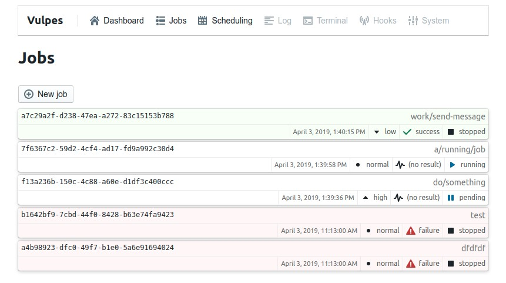

# Vulpes UI
> Web-based GUI for Vulpes

[](https://travis-ci.org/Kiosked/vulpes-ui)



## About

Vulpes-UI is a plugin for the Vulpes platform that provides a web-based user interface to manage Vulpes jobs. Vulpes provides a `Service` which can be used to connect with Vulpes-UI to display jobs and their properties. Vulpes-UI provides a basic API (not related to [Vulpes-API](https://github.com/Kiosked/vulpes-api)) for handling UI events.

## Installation

Install by running `npm install vulpes-ui --save`. Vulpes-UI depends on vulpes as a peer dependency, so you must have that installed as well.

## Usage

Usage is simple enough - we recommend attaching the Vulpes UI router to the root `/` route:

```javascript
const express = require("express");
const { Service } = require("vulpes");
const { createVulpesRouter } = require("vulpes-ui");
const app = express();
const port = 3000;

// Create a new service
const service = new Service();

service.initialise().then(() => {
    app.use("/", createVulpesRouter(service));

    app.listen(port, () => {
        console.log(`Application listening on port ${port}`);
    });
});
```

The method `createVulpesRouter` takes a Vulpes `Service` instance:

```javascript
// Returns an Express router instance
createVulpesRouter(service);
```

The returned value is a router instance from [`express-promise-router`](https://github.com/express-promise-router/express-promise-router).

## Data Aspects

Vulpes UI reacts to various states of job data, many of which you can affect by setting result data or something similar.

### Job Progress

Vulpes UI can render a progress bar on jobs that are:

 * Running
 * Returning progress metrics _as they proceed_

Job progress metrics are to be stored in result data, which can be set even while the job is running. The properties are as follows (note the hidden-property prefix `%`):

 * `%progressCurrent`: The current progress value - a number greater than or equal to 0.
 * `%progressMax`: The maximum progress value - a number greater than or equal to 0, but greater than or equal to `%progressCurrent`.

For example: if a job was processing images, and `108` out of `165` had been processed, you might set `%progressCurrent` to `108` and `%progressMax` to `165` which would render _65%_ in the UI.
